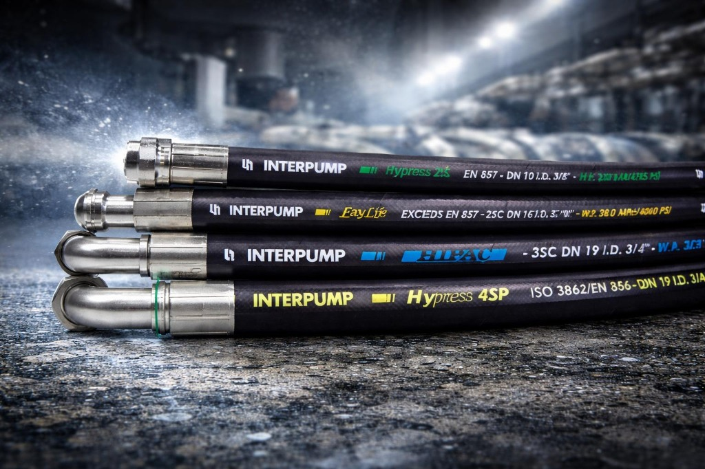

# Metric Mechanical Equipment Spare Parts Trading LLC

A premium, high-performance corporate web application for an industrial mechanical equipment supplier based in the UAE. This project demonstrates a modern approach to B2B industrial websites, combining technical precision with a sophisticated user experience.



## 🚀 Key Features

- **Dynamic Industrial Design**: A sleek, dark-themed interface with glassmorphism effects and custom mechanical animations.
- **Product Catalog**: A fully searchable and filterable industrial catalog featuring specialized categories like Hoses, Fittings, and Valves.
- **Interactive Particle System**: Custom-built background particle engine that simulates mechanical connectivity and precision.
- **Seamless Navigation**: Integrated React Router implementation with smart-scrolling for cross-route inquiry redirects.
- **Custom Iconography**: Bespoke SVG icons designed specifically for industrial components (Hydraulic Valves, Precision Bearings, etc.).
- **Responsive & Mobile Optimized**: Built with a mobile-first approach ensuring a premium experience on all devices.

## 🛠️ Technical Stack

- **Framework**: [React 19](https://reactjs.org/)
- **Build Tool**: [Vite](https://vitejs.dev/)
- **Animations**: [Framer Motion](https://www.framer.com/motion/)
- **Icons**: [Lucide React](https://lucide.dev/) & Custom SVGs
- **Styling**: Vanilla CSS with Modern CSS Variables
- **Particles**: [@tsparticles/react](https://particles.js.org/)

## 📦 Getting Started

1. **Clone the repository**
   ```bash
   git clone https://github.com/your-username/metricmechequip-demo.git
   ```

2. **Install dependencies**
   ```bash
   npm install
   ```

3. **Run development server**
   ```bash
   npm run dev
   ```

4. **Build for production**
   ```bash
   npm run build
   ```

## 🏗️ Project Structure

- `src/sections`: Contains the main landing page blocks (Hero, Services, Contact, etc.).
- `src/pages`: Includes specialized pages like the Industrial Catalog.
- `src/components`: Reusable UI elements and custom SVG icon definitions.
- `public/`: Static assets including high-resolution industrial photography.

---

Designed for **Metric Mechanical Equipment Spare Parts Trading LLC** | Ajman, UAE.
